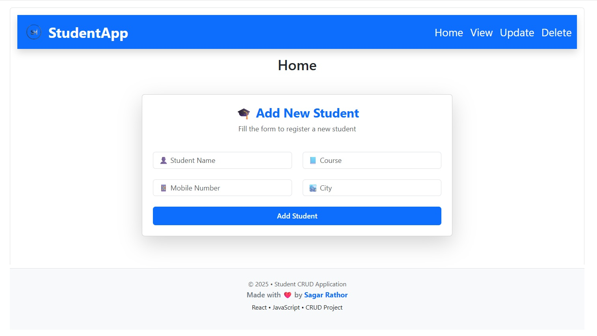
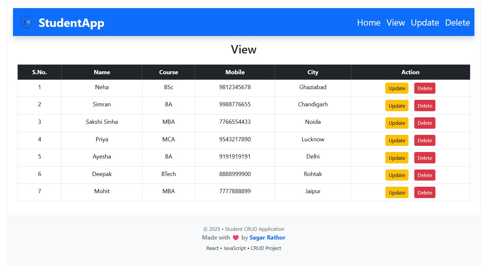
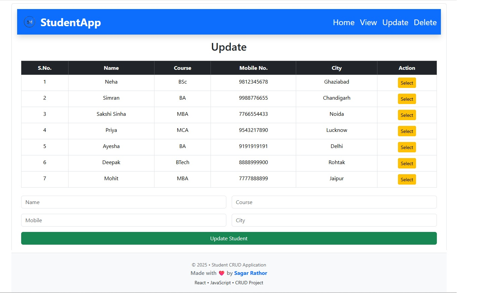
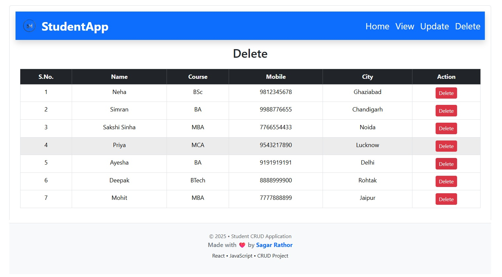

# 🎓 Student Management CRUD Application

A modern and beginner-friendly **Student Management System** built with **⚛️ React** and **🔗 Axios**, designed to perform full **CRUD (Create, Read, Update, Delete)** operations by communicating with a **🌐 RESTful backend API**.

This project focuses on **🧼 clean code structure**, **♻️ reusable components**, and **🧠 real-world API integration**, making it a strong **📁 portfolio project** for frontend developers.

---

## ✨ Key Highlights

✅ Full CRUD (Create, Read, Update, Delete) functionality  
🔗 REST API integration using Axios  
🧩 Reusable & modular React components  
📱 Responsive and user-friendly UI  
🗂️ Real-world project structure  
👶 Beginner-friendly & 👔 recruiter-approved

---

## 🚀 Features

➕ Add new student records  
📋 View all students in a list  
✏️ Edit student information  
🗑️ Delete student records  
🔄 Real-time data updates via API  
⚡ Fast and smooth UI experience  

---

## 🧰 Tech Stack

| 🛠️ Technology | 🚀 Usage |
|--------------|---------|
| ⚛️ **React** | Frontend UI |
| 🔗 **Axios** | API communication |
| 🟨 **JavaScript (ES6+)** | Application logic |
| 🎨 **CSS / Bootstrap** | Styling & layout |
| 🌐 **REST API** | Backend communication |

---

## 🧠 What I Learned

📌 Building real-world CRUD applications using **React**  
🔗 Integrating REST APIs efficiently using **Axios**  
🧩 Understanding **component-based architecture**  
🎣 Managing application state using **React Hooks**  
🗂️ Designing **clean and scalable folder structures**  
🐞 Debugging issues and handling API data & errors  

---

## 🔮 Future Enhancements

🛡️ Implement proper **form validation**  
🔍 Add **search & filter** functionality for students  
📄 Implement **pagination** for large datasets  
🔐 Add **authentication & authorization**  
🎨 Improve overall **UI/UX experience**

---

## 📸 Screenshots

### 🏠 Home Page

### ➕ View Student

### ✏️ Update Student

### ❌ Delete Student

---

## Author
**Sagar** – [Portfolio](https://sagar-portfolio-mern.netlify.app/) | [LinkedIn](https://www.linkedin.com/in/sagar-web-dev/)

---
